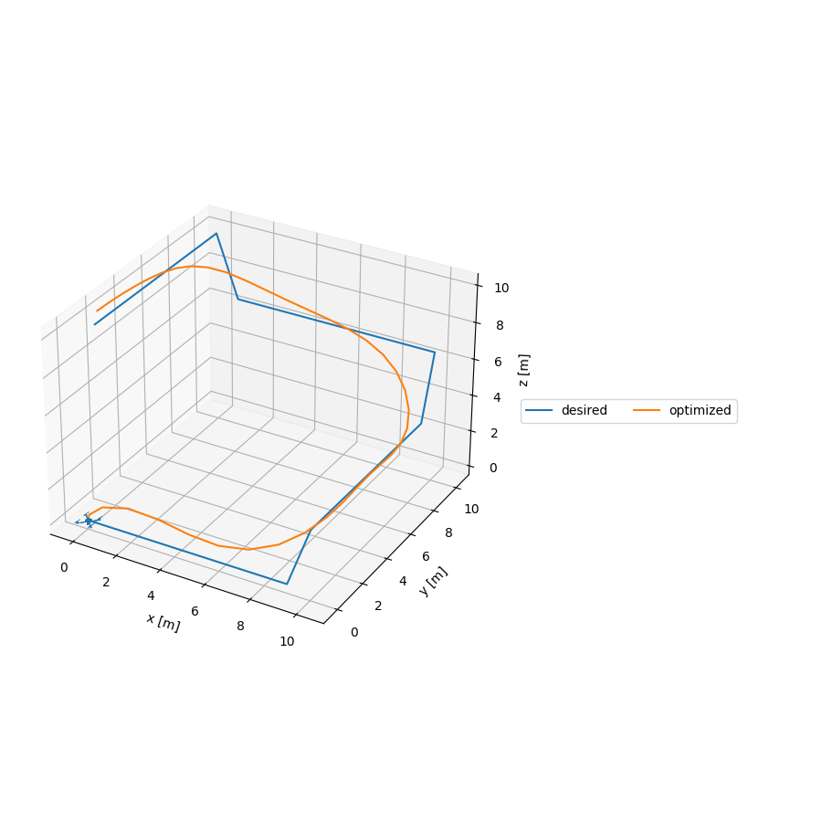

# Quadrotor Iterative Linear Quadratic Regulator

This is an implementation of an Iterative Linear Quadratic Regulator (iLQR) to generate trajectories for a quadrotor model. This model is interesting as the configuration space of the quadrotor is $q \in SE(3)$ and the body velocity is $^\mathcal{X} v^\wedge{} \in T_\mathcal{X}SE(3)$, where the $^\wedge$ operator maps elements $v \in \mathbb{R}^3$ to elements in $T_\mathcal{X}SE(3)$. Therefore, the state of the quadrotor can be represented by $x = (q, v) \in {SE(3) \times \mathbb{R}^3}$. Generating trajectories for a quadrotor using iLQR is an interesting exercise as the state is not simply a member of $\mathbb{R}^n$ as is the usual case presented.

For more details on the applicable lie theory see this handy reference: [A micro Lie theory for state estimation is robotics](https://arxiv.org/pdf/1812.01537.pdf). For more information on iLQR see [Tassa et al.](https://homes.cs.washington.edu/~todorov/papers/TassaICRA14.pdf).

src/quadrotor_ilqr.py creates a quadrotor model, a desired trajectory, runs the optimizer via it's python binding, and plots the optimized trajectory. You can run the quadrotor trajectory planner via the command `bazel run //src:quadrotor_ilqr -- --show_plots`. This should produce the following animation:

